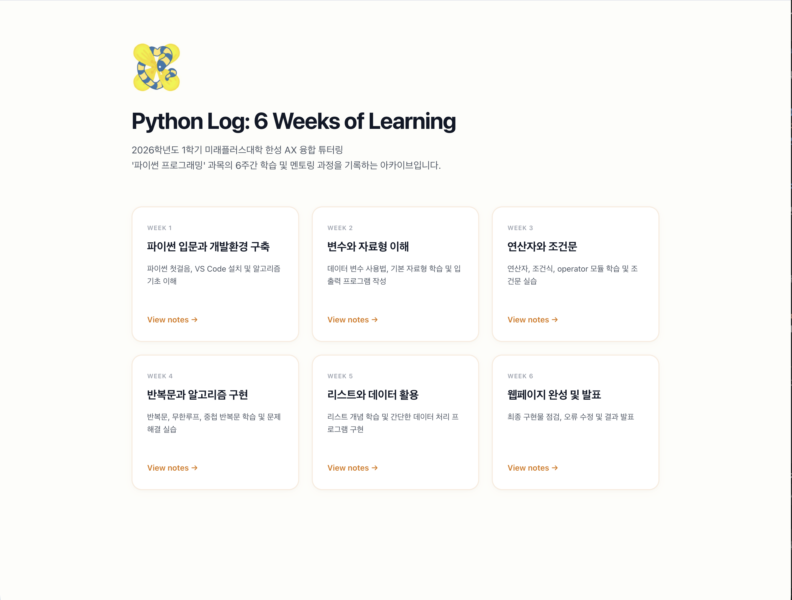

# 🌼 Canola Python: 한성 AX 융합 파이썬 프로그래밍 튜터링 아카이브

2026학년도 1학기 미래플러스대학 재학생을 대상으로 진행하는 파이썬 프로그래밍 튜터링 학습 노트 아카이브 웹사이트 **"Canola Python"**입니다. 유채꽃의 따뜻한 감성과 IT 아카이브 컨셉을 결합한 반응형 웹 어플리케이션입니다.

### 🔗 배포 주소 (Live URL)
👉 **[https://yuminc03.github.io/hansung-python-tutoring/](https://yuminc03.github.io/hansung-python-tutoring/)**

---

### 🖥️ 홈 화면 프리뷰 (Homepage Preview)



---

## 🌟 주요 기능 및 특징 (Key Features)

1. **유채꽃 컨셉의 따뜻한 브랜딩 디자인**
   - 따뜻한 봄볕을 담은 **아이보리 크림 옐로우 (#FDFDF9)** 배경과 텍스트 가독성을 극대화한 **오렌지 골든 옐로우 (#D97706)** 포인트 컬러를 사용하여 정갈하고 미니멀한 애플 스타일 레이아웃을 구현했습니다.
   - 홈 화면 하단에 튜터와 튜티 캐릭터 및 소개 정보를 수록한 **About the Creator** 카드와 GitHub 저장소 아이콘이 연동된 푸터(Footer)를 제공합니다.

2. **다크 모드(Dark Mode) 및 전역 테마 토글**
   - 사용자가 원할 때 언제든 라이트/다크 테마를 전환할 수 있는 직관적인 스위치(Sun/Moon 아이콘)를 탑재했습니다.
   - 전환 시 전역 스타일시트의 300ms 부드러운 애니메이션 효과를 주었으며, 사용자의 선택 상태는 브라우저 `localStorage`에 즉시 캐싱되어 재방문 시에도 테마 설정이 유지됩니다.

3. **고정형 반응형 목차(TOC) 내비게이션**
   - 주차별 마크다운 파일의 제목(H2)을 자동 파싱하여 화면 좌측에 사이드바 형태의 목차를 동적으로 생성합니다.
   - 모바일/태블릿 화면에서는 슬라이드인(Slide-in Overlay) 햄버거 메뉴로 전환되며, 닫기(X) 버튼 영역 확보를 위해 사이드바 내부의 토글 스위치는 숨기고 모바일 상단 네비게이션 헤더의 **절대 중앙 스위치**로 스마트하게 통합했습니다.

4. **코드 하이라이팅 및 복사 기능**
   - 마크다운 내의 코드블록을 가독성 높은 다크 테마 구문 강조(`Prism Syntax Highlighter`)로 보여주며, 마우스 호버 시 활성화되는 **Copy(복사) 버튼**을 통해 편리한 실습 코드 복사가 가능합니다.

5. **모바일 웹앱(PWA) 대응 및 최적화**
   - `manifest.json`을 적용하여 안드로이드 크롬 및 iOS 사파리 환경에서 모바일 '홈 화면에 추가'할 수 있는 고해상도 앱 아이콘과 메타태그 설정이 완벽하게 완료되었습니다.

---

## 🚀 사이트 업데이트 및 배포 방법 (중요)

이 프로젝트는 GitHub Pages를 통해 정적 호스팅 및 배포가 진행됩니다. 새로운 튜터링 학습 노트를 추가하거나 디자인/기능을 수정한 경우 **반드시 배포 명령어를 실행하여 퍼블리싱을 완료해야 합니다.**

### 📌 배포가 필요한 시점
- `src/data/notes/` 폴더에 새로운 주차의 **마크다운(.md) 학습 내용**을 작성하거나 수정했을 때
- `src/data/curriculum.js` 파일의 **커리큘럼 타이틀 및 내용 요약**을 변경했을 때
- UI 디자인 개선이나 컴포넌트 추가를 완료한 후 **실제 웹사이트에 동기화**하고 싶을 때

### 💻 배포 명령어
수정을 모두 마쳤다면, VS Code 터미널 환경에서 아래의 단일 명령어를 실행합니다.
```bash
npm run deploy
```
*(실행 시 Vite 정적 빌드와 `.nojekyll` 생성이 백그라운드에서 진행된 후, 결과물이 자동으로 `gh-pages` 브랜치에 업로드되어 배포가 갱신됩니다.)*

---

## 🛠 로컬 개발 환경 실행 (테스트용)

로컬 컴퓨터에서 코드를 수정하고 실시간으로 화면을 미리 확인하려면 아래 명령어를 사용해 로컬 서버를 구동하세요.
```bash
npm run dev
```

---

## 💡 라우팅 구조 참고 사항 (Router)

본 사이트는 GitHub Pages의 정적 서버 사양(새로고침 시 경로를 찾지 못하고 404를 발생하는 한계)을 극복하고자 **`HashRouter`**를 적용하여 구축되었습니다.
- **주소 규칙**: 모든 이동 경로 앞에 `/#/`이 포함됩니다. (예: `.../#/note/1`)
- **작동 원리**: 해시 기호(`#`) 뒤의 경로는 서버에 전송되지 않고 브라우저 프런트엔드 단(React Router)에서만 해석되므로, **실서버 새로고침 시 404 오류가 발생하는 이슈를 원천 차단**할 수 있습니다.
